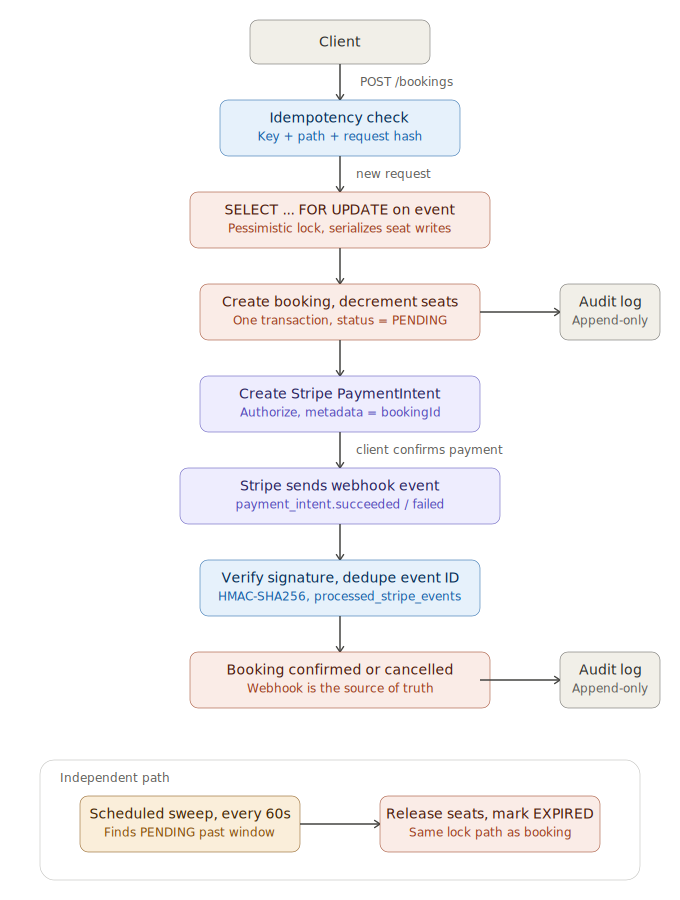

# Event Booking & Payment System

A backend payments system built to demonstrate the same correctness, concurrency, and auditability problems a real fintech payments team deals with. This isn't a CRUD tutorial with Stripe bolted on top.

**The headline result:** 100 concurrent requests racing for the last 10 seats on an event. Exactly 10 succeed. 90 are cleanly rejected. No overselling, no deadlocks. Verified against a real MySQL instance, not mocked.

```
$ ./gradlew test --tests BookingConcurrencyTest

100 threads, 10 available seats:
  successCount   = 10
  soldOutCount   = 90
  unexpectedErrorCount = 0
  final availableSeats = 0
  booking rows for this event = 10

BUILD SUCCESSFUL
```

## Why this project exists

Fintech and payments teams run into a specific set of problems that a typical CRUD app never has to deal with. What happens when two requests try to claim the same resource at the same instant. What happens when a network call gets retried and arrives twice. What happens when a third party's webhook is the only thing you can actually trust. Whether you can reconstruct exactly what happened to any single record after the fact. This project is built around those four problems, using event ticket booking with real payment processing as the domain because it forces all four to show up naturally.

## Tech stack

| Layer | Choice |
|---|---|
| Language / framework | Java 21, Spring Boot 3.3.4 |
| Build | Gradle |
| Database | MySQL 8.0, schema versioned with Flyway |
| Payments | Stripe Java SDK (PaymentIntents, webhooks) |
| Testing | JUnit 5, Mockito, real MySQL via Docker Compose for integration tests |
| Containers | Docker, Docker Compose |

## Architecture



A booking request goes through an idempotency check, then a pessimistic row lock on the event, then a single transaction that creates the booking and decrements seat availability. Payment is a separate step. A Stripe PaymentIntent gets created against the now existing PENDING booking, and the booking only moves to CONFIRMED when Stripe's webhook says the payment succeeded, not when the client says so. A scheduled sweep runs independently and expires any booking that sits unpaid past its reservation window, releasing the seat back through the same locking path.

## What this project demonstrates

### 1. Concurrency correctness, proven not claimed

`BookingService.createBooking()` takes a pessimistic row lock (`SELECT ... FOR UPDATE`) on the event row before checking availability and decrementing seats. The lock holds for the whole transaction, so two concurrent requests for the last seat get serialized at the database level. The second one just waits until the first commits or rolls back, then sees the updated count.

`BookingConcurrencyTest` fires 100 threads at an event with 10 seats, synced with a `CountDownLatch` so they hit the lock as close to simultaneously as the JVM scheduler allows. It checks the exact outcome shown above, against a real MySQL container, not H2, not a mock. The whole point is to exercise InnoDB's actual locking behavior instead of an in-memory approximation of it.

### 2. Idempotency at both layers that actually need it

Two separate idempotency problems show up in any real payments system, and they're solved differently here on purpose:

- **Client retries** (`Idempotency-Key` header on `POST /bookings` and `POST /payment-intent`). The request hash and response get stored keyed on `(key, path)`. A retried request with the same key and body gets the original response replayed untouched instead of re-executing. A retry with the same key but a different body gets rejected with 409. That's a client bug, not something to quietly paper over.
- **Stripe webhook retries**. Stripe documents that the same webhook event can get delivered more than once. That's deduped separately, keyed on Stripe's own event ID, in a different table (`processed_stripe_events`). Mixing the two together would couple two unrelated retry sources into one mechanism that doesn't really fit either one.

Both use the same underlying trick: try an insert and let the database's unique constraint decide whether you've seen this before, instead of doing a check then act that needs its own lock.

### 3. The webhook is the source of truth, not the client

`PaymentService.createPaymentIntentForBooking()` creates a Stripe PaymentIntent but the booking stays PENDING. It only becomes CONFIRMED inside `StripeWebhookService`, after the webhook's signature is verified against the signing secret and the event has been deduped. A client claiming "payment succeeded" in its own request is never trusted. Only a verified webhook from Stripe can move a booking into a paid state. That's the same trust boundary a real payments integration has to enforce, and it's tested with signature verification tests that build valid and deliberately forged `Stripe-Signature` headers by hand.

### 4. Full auditability

Every booking state transition (created, confirmed, cancelled, expired) writes an immutable row to an append only audit log, tagged with what triggered it (USER_ACTION, STRIPE_WEBHOOK, or SYSTEM_EXPIRY) and a correlation ID. Given a booking ID, you can reconstruct its complete history after the fact. That's the exact question a support or compliance team asks during a real incident.

### 5. Money handled the way fintech code actually has to be

All amounts are stored and computed as integer cents (`long`), never `float`/`double`. A `Money` value object wraps `(amountCents, currency)` so call sites read as "5000 cents, USD" instead of a bare number that's easy to misread as dollars or mix up across currencies.

## Idempotency, more detail

A client facing idempotency record looks like this:

| idempotency_key | request_path | request_hash | status | response_status | response_body |
|---|---|---|---|---|---|
| `c3f1...` | `/api/events/4/bookings` | sha256 of body | `COMPLETED` | `201` | the original response |

Scoping the uniqueness constraint to `(key, path)` instead of just `key` means a sloppy client reusing the same key across two different endpoints doesn't cross wire two unrelated responses. Each endpoint gets its own slot for the same key.

The claim sequence:
1. Look up `(key, path)`. Nothing found, so insert a new IN_PROGRESS row. If that insert collides with a row inserted by a concurrent request in the gap between the lookup and the insert, the unique index throws, and that's the signal to fall back to re-reading the row instead of treating it as a hard failure.
2. Found and COMPLETED with a matching hash. Replay the stored response untouched, never re-running the business logic.
3. Found with a different hash. 409, the key got reused for a logically different request.
4. Found and still IN_PROGRESS. 409, a concurrent duplicate is already being processed and we don't block and wait on it.

## Running it locally

You'll need Docker and JDK 21.

```bash
git clone git@github.com:singhbhupinder55/Event-Booking-And-Payment-Processing-System.git
cd event-booking
gradle wrapper --gradle-version 8.10   # one time, generates ./gradlew

# Start MySQL for tests
docker compose -f docker-compose.test.yml up -d

# Run the full test suite, including the concurrency test
./gradlew test

docker compose -f docker-compose.test.yml down
```

To run the app itself, set the Stripe test mode keys as environment variables:

```bash
export STRIPE_SECRET_KEY=sk_test_...
export STRIPE_WEBHOOK_SECRET=whsec_...
./gradlew bootRun
```

Forward Stripe webhooks to your local instance with the Stripe CLI while developing:

```bash
stripe listen --forward-to localhost:8080/api/webhooks/stripe
```

### Example requests

Create an event:
```bash
curl -X POST localhost:8080/api/events \
  -H "Content-Type: application/json" \
  -d '{"name":"Concert","totalCapacity":50,"priceCents":5000,"currency":"USD","startsAt":"2026-12-01T20:00:00Z"}'
```

Book a seat (note the required `Idempotency-Key`):
```bash
curl -X POST localhost:8080/api/events/1/bookings \
  -H "Content-Type: application/json" \
  -H "Idempotency-Key: $(uuidgen)" \
  -d '{"userReference":"user-123","seats":2}'
```

Create a PaymentIntent for that booking:
```bash
curl -X POST localhost:8080/api/bookings/1/payment-intent \
  -H "Idempotency-Key: $(uuidgen)"
```

Check live metrics:
```bash
curl localhost:8080/api/metrics
```

## Design decisions

**PaymentIntents over Charges.** PaymentIntents model the full payment lifecycle (requires_payment_method, requires_confirmation, processing, succeeded/failed) and are SCA/3D Secure ready. Charges are the older, simpler API and don't carry that lifecycle. Even for a flow this simple, PaymentIntents are what a real integration would actually use. Using Charges here would have been the easier path and the wrong one.

**Pessimistic locking over optimistic locking for seat counts.** Under heavy contention for a small number of remaining seats, optimistic locking with version based retry means most concurrent requests fail with a version conflict and need client side retry logic. That pushes complexity outward and adds latency. A short held pessimistic lock on a single row is simpler to reason about, fast enough at this scale, and is what the concurrency test actually validates.

**Integer cents over floating point, always.** 0.1 + 0.2 doesn't equal 0.3 in binary floating point. Storing money as anything other than an integer in its smallest unit is a correctness bug waiting to happen, and an instant red flag in any real fintech code review.

**Two separate idempotency mechanisms, not one.** Client retries and Stripe's webhook retries are different problems with different keys, different failure modes, and different consumers. Forcing them through one mechanism would have made both worse.

**@Scheduled and @Transactional split across two beans.** This came from a real bug caught during development. Spring's @Transactional is implemented as a proxy around a bean, and a method calling another method on `this` within the same class bypasses that proxy entirely. So the inner method's transaction boundary silently never applies. The reservation expiry sweep originally lived in one class and intermittently failed with "no transaction in progress" errors on the pessimistic lock query. The fix was splitting the @Scheduled loop and the @Transactional per booking logic into two separate Spring beans, so the call between them actually crosses a proxy boundary. Worth knowing as a general Spring AOP gotcha, not just a fix for this one file.

**MySQL via Docker Compose instead of Testcontainers for integration tests.** The original plan used Testcontainers to programmatically manage a MySQL container per test run. On the development machine, Testcontainers' Docker API client kept getting empty, malformed responses back from a current Docker Desktop version. I confirmed the Docker daemon itself was completely healthy by checking it independently: a direct curl against the Unix socket and a bare Java NIO socket call both returned correct, fully populated responses. The fault was isolated to Testcontainers' HTTP over Unix socket transport layer specifically, not the daemon, not the Docker install, and not the test code. Rather than keep fighting a library incompatibility that was specific to this machine, MySQL for tests now starts through a plain docker-compose.test.yml and the test suite connects to a fixed port. Still real MySQL, still real InnoDB locking, just with the container lifecycle managed by hand instead of by a library that wasn't cooperating.

## Test coverage

Unit tests cover the booking state machine, money math, idempotency claim/replay/conflict logic, Stripe webhook event routing and dedup, the reservation expiry sweep, and the metrics counters, including a 100 thread concurrent increment test.

Integration tests run against real MySQL: the booking concurrency test, idempotent request replay, the expiry sweep, and end to end booking flows.

Webhook signature verification is tested with hand constructed valid and forged Stripe-Signature headers, following Stripe's documented HMAC-SHA256 scheme.

## What's intentionally out of scope

No microservices. A clean monolith is the right scope here, and splitting this into services would be solving a problem that doesn't exist yet. No Kafka or event sourcing either. The audit log already answers "what happened," and adding an event bus on top would be architecture for its own sake. No frontend, since this is a backend focused portfolio piece and the curl examples above plus the test suite are the interface. No live hosted deployment yet either. The priority was getting the correctness story right first, and deployment is a separate decision to make once the system itself is done.
